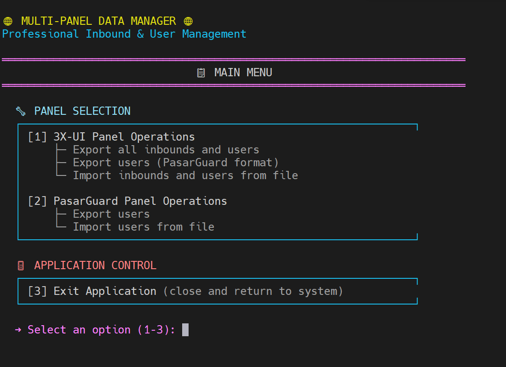

<div align="center">

# 🚀 مهاجرت از پنل سنایی به پاسارگارد


# مدیر کاربران و Inbound پانل‌ها

[🇬🇧 English](./README_EN.md) | [🇮🇷 فارسی](./README.md)

<p>
یک ابزار قدرتمند و جامع برای مهاجرت کاربران بین پنل‌های 3X-UI و PasarGuard
</p>


</div>

---

این یک ابزار مهاجرت بین پنل‌های 3X-UI و PasarGuard می‌باشد.
با این ابزار، اکانت VPN کاربران خود را با حفظ مقدار ترافیک و زمان باقی‌مانده بین پنل‌های 3X-UI و PasarGuard جابه‌جا کنید.

**🎯 هدف اصلی: انتقال کاربران از پنل 3X-UI به پنل PasarGuard**

## ✨ ویژگی‌ها

<div>

- ✅ خروجی‌گیری (Backup) از تمام کاربران پنل 3X-UI با یا بدون مشخصات اینباند
- ✅ خروجی‌گیری (Backup) از تمام کاربران پنل PasarGuard
- ✅ خروجی کاربران به فرمت سازگار با هر دو پنل
- ✅ تبدیل، انتقال و وارد کردن کاربران به دو نوع پنل 3X-UI و PasarGuard
- ✅ مدیریت خودکار ترافیک کاربران در طی انتقال
- ✅ حل خودکار تضادهای نام‌کاربری در پنل‌ها
- ✅ تعیین Groups مشخص برای کاربران در همان لحظه انتقال به PasarGuard

</div>

## 🚀 نحوه استفاده

### کامپایل کردن

```bash
cd /root/Panels_Migration
go build -o Panels_Migration ./cmd/main
./Panels_Migration
```

### راه‌اندازی

```bash
curl -sSL https://raw.githubusercontent.com/ArashAfkandeh/Panels-Migration/main/install.sh | sudo bash && /root/Panels_Migration
```

### گام‌های اصلی

برنامه یک رابط منو‌محور دارد که شامل بخش‌های زیر است:

**📋 MAIN MENU:**
- **🔧 PANEL SELECTION** - انتخاب پنل مورد نظر (3X-UI یا PasarGuard)
- **🚪 APPLICATION CONTROL** - خروج از برنامه

**3X-UI OPERATIONS:**
- **📤 EXPORT OPERATIONS** - خروجی کاربران و Inbound‌ها
- **📥 IMPORT OPERATIONS** - واردسازی کاربران و Inbound‌ها
- **🔙 NAVIGATION** - بازگشت به منوی اصلی

**PASARGUARD OPERATIONS:**
- **📤 EXPORT OPERATIONS** - خروجی کاربران
- **📥 IMPORT OPERATIONS** - واردسازی کاربران
- **🔙 NAVIGATION** - بازگشت به منوی اصلی

## 📸 منوی برنامه



## 📋 راهنمای استفاده‌ی مختصر

### انتقال کاربران از 3X-UI به PasarGuard

**مرحله‌ی اول - خروجی‌گیری از 3X-UI:**

```
1. برنامه را اجرا کنید: ./Panels_Migration
2. گزینهٔ [1] را انتخاب کنید (3X-UI Panel Operations)
3. گزینهٔ [2] را انتخاب کنید (Export users only - PasarGuard format)
4. مشخصات پنل 3X-UI را وارد کنید:
   - آدرس: https://panel.example.com:port/path
   - نام‌کاربری: admin
   - رمز عبور: password
5. نام فایل خروجی را مشخص کنید (مثلاً: users_backup.json)
```

**مرحله‌ی دوم - واردسازی به PasarGuard:**

```
1. برنامه را دوباره اجرا کنید: ./Panels_Migration
2. گزینهٔ [2] را انتخاب کنید (PasarGuard Panel Operations)
3. گزینهٔ [2] را انتخاب کنید (Import users from JSON)
4. مشخصات پنل PasarGuard را وارد کنید:
   - آدرس: https://panel.example.com:port
   - نام‌کاربری: admin
   - رمز عبور: password
5. مسیر فایل خروجی قبلی را وارد کنید: users_backup.json
6. گروه‌های موردنظر را انتخاب کنید.
```

## ⚠️ نکات

- برای انتقال کاربران از پنل 3X-UI به پنل PasarGuard حتماً باید خروجی کاربران `(بدون مشخصات اینباند)` را بگیرید.
- **پروتکل‌های پشتیبانی‌شده:** این ابزار فعلاً فقط از انتقال کاربران با پروتکل‌های **VLESS** و **VMess** پشتیبانی می‌کند.
- **پشتیبان‌گیری:** همیشه قبل از انتقال کاربران، از داده‌های خود پشتیبان تهیه کنید
- **دسترسی API:** مطمئن شوید که به API پنل‌ها دسترسی داشته باشید و فایروال مسدود نکند
- **ترافیک کاربران:** در طی انتقال، ترافیک کاربر از مقدار `traffic_remaining` محاسبه می‌شود
- **تضادهای نامگذاری:** اگر نام‌کاربری تکراری باشد، برنامه خودکار پسوند اضافه می‌کند (مثلاً: `user_1`)

## 🔍 نحوه‌ی استفاده‌ی Verbose

برای دیدن جزئیات عملیات و عیب‌یابی، برنامه را با آرگومان `-v` اجرا کنید:

```bash
./Panels_Migration -v
```

این حالت نمایش می‌دهد:
- جزئیات درخواست‌های API
- نقشه‌برداری UUID‌ها
- مراحل حل تضادهای نام‌کاربری
- محاسبات ترافیک

## 💖 حمایت مالی

<div align="center">

برای پشتیبانی از پروژه ما، TRX (شبکه TRC-20) واریز کنید:


```
THzUk99MRsGDgrYK1Nh1YhA3cVuTosmHoA
```

از حمایت شما سپاسگزاریم! ❤️

</div>

---

<div align="center">

**استفاده آسان برای انتقال و مدیریت کاربران**

**Made with ❤️ by ArashAfkandeh**

</div>
